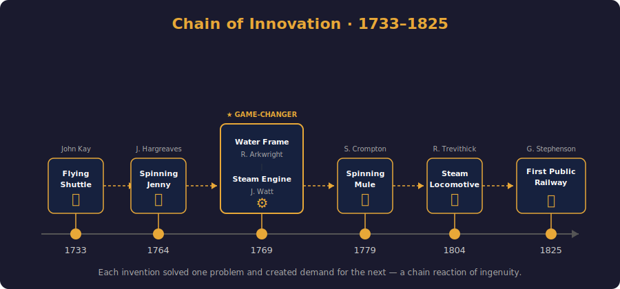
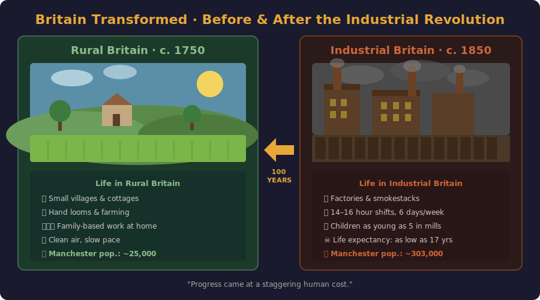

# Visual Aids Guide

> **Requirement**: Use 1–2 visual aids or slides to enhance the presentation; images are essential.

This presentation uses **2 visual aids** — each tied to a specific section of the speech. Display each image at the moment indicated in the script, then remove it so the audience refocuses on you.

---

## Visual Aid 1 — Innovation Timeline

**Display during**: Section 3 · Key Inventions & Breakthroughs

**File**: [`images/innovation_timeline.svg`](images/innovation_timeline.svg)

**What it shows**: A timeline of the six key inventions from 1733 (Flying Shuttle) to 1825 (First Public Railway), with inventors, icons, and dashed arrows illustrating how each breakthrough triggered the next.

**When to show**: Display the image as you begin Section 3 ("And the sparks came fast…"). Point to each milestone as you mention it. Remove the image before transitioning to Section 4.

**Why it works**: Visualising the chain reaction of inventions reinforces the key argument — that innovation was cumulative, not isolated.

---

## Visual Aid 2 — Before & After Comparison

**Display during**: Section 5 · The Dark Side

**File**: [`images/before_after_comparison.svg`](images/before_after_comparison.svg)

**What it shows**: A side-by-side comparison of Rural Britain (c. 1750) and Industrial Britain (c. 1850), contrasting green fields and cottages with factories, smokestacks, and crowded slums. Key statistics (population, working hours, life expectancy) are listed beneath each panel.

**When to show**: Display the image as you begin Section 5 ("But progress came at a staggering human cost…"). Let the audience absorb the contrast while you describe the dark side. Remove the image before transitioning to the Conclusion.

**Why it works**: The stark visual contrast dramatises the human cost of industrialisation far more effectively than words alone.

---

## Practical Tips

- **Format**: The images are in SVG format (scalable, crisp at any size). They can also be exported to PNG/PDF for printing or embedding in slides.
- **Display method**: Show on a laptop, project on screen, or print as A3/A4 posters.
- **Timing**: Each visual aid is on screen for roughly 1–1.5 minutes, then removed.
- **Minimal text**: Both images are designed to be understood at a glance — the speech provides the detail.
